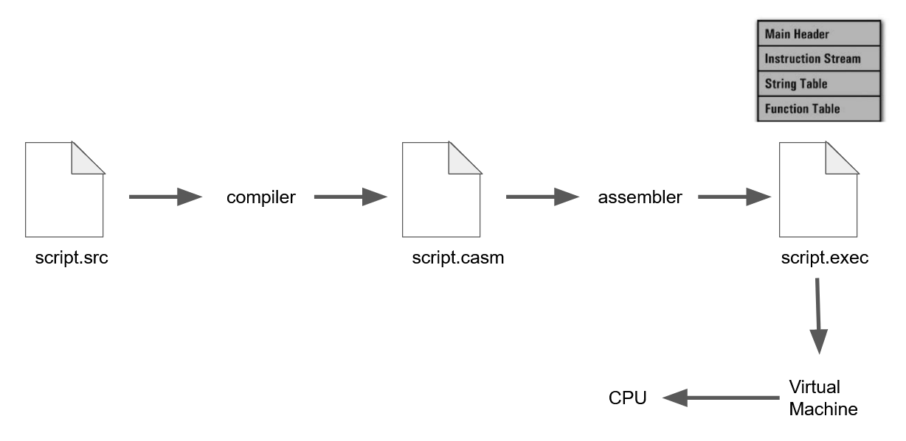

# Custom Programming Language 
#### Author: Bug Lee
#### Last updated: December 2022

## Table of Contents
- [Custom Programming Language](#custom-programming-language)
      - [Author: Bug Lee](#author-bug-lee)
      - [Last updated: December 2022](#last-updated-december-2022)
  - [Table of Contents](#table-of-contents)
  - [Introduction](#introduction)
  - [Project Overview](#project-overview)
    - [Virtual Machine](#virtual-machine)
    - [Assembler](#assembler)
    - [Compiler](#compiler)
  - [Building the project](#building-the-project)
  - [Examples](#examples)

Below is a snippet of the [project report](proj_report/proj_report.pdf).
## Introduction
Over the years, the complexity of compiler design has immensely increased. At the hardware level, there are more diverse and sophisticated instruction sets to consider. At the software level, complex optimization schemes have been introduced for maximal performance, in addition to different language paradigms. As a result, the complexity of the modern compiler design overshadows the fundamentals behind the language construction as well as making the steps between programming language and execution more mysterious. For this reason, this project focused on two aspects: (1) building a simplified version of each component used in programming language construction, and (2) understanding how each component works together to execute a custom programming language. This report describes the semester-long project of building a C-like (C subset) programming language from scratch. 

## Project Overview

The project was broken down into 3 parts, ordered from lower level to higher level: Virtual Machine, Assembler, Compiler. Each level depends on the level right below it, except for Virtual Machine which is a standalone software.

### Virtual Machine
The Virtual Machine mimics the generic single-cycle hardware processor. The following describes the similarity:

- Load instructions from the executable to the instruction cache. 
- Load and store a value into runtime stack and keep track of stack frame using stack pointer and frame pointer.
- Use the return register to access the return value from a function.
- Use the instruction pointer to read and execute the next instruction.
- Execute one instruction in a single cycle.

However, since the Virtual Machine was implemented using C++ instead of transistors, it was flexible for more functionalities that are not available in generic hardware:
- Include the function cache that load all the function information from the executable.
- Perform type resolution/casting/coercion during runtime.

The Virtual Machine support 38 instructions (see appendix A). The instruction set for Virtual Machine was designed to follow the Complex Instruction Set Computing (CISC) methodology. This is to make the runtime environment faster: doing as much work as possible in C++ instead of leaving implementation to a slower custom language.

Overall, the role of the Virtual Machine is to set the first point of simplification. Even with the simpler instruction set, however, writing binary executables by hand would be a painful task. Which lead to the implementation of the assembler.

Note that the Virtual Machine design was adapted from the Varanese's XVM. However, there are three major differences. First, the custom VM was coded in C++ instead of C. Secondly, unlike XVM, it was simplified to single-threaded and stand-alone software. Finally, 6 instructions for string concatenation and conditional jumps support in XVM were removed in the custom VM. Instead, 12 new instructions were added to the custom VM. 

### Assembler
Like generic assemblers, the main functionality is to allow users to use mnemonics and numeric operands, which then get translated to binary executables. However, the custom assembler supports more advanced features and takes advantage of flexibility from the Virtual Machine:
- Differentiate function and label. Use \textbf{func} directive and curly braces to define function. Automatically add \textbf{ret} instruction at the end of the function after assembling.
- Use \textbf{var} and \textbf{param} directives to define variables or arrays and automatically reserve space inside the stack.
- Support functional scope. 
- Direct support for string type.
- Support for basic string processing.
- Allow instruction to accept a string, variable, and element inside an array (absolute or variable index). Note that type checking is done by the Virtual Machine during the runtime.

However, the limitation of expressivity and tedium of controlling the runtime stack still made assembly language difficult to program with and error-prone. The compiler improves on this issue.

Note that the Assembler design was adapted from the Varanese's XASM. However, there are three major differences compared to XASM. First, the custom assembler was coded in C++ instead of C. Secondly, the lexer for the custom assembler was implemented using regular expression and state machine whereas XASM used a brute force approach. Finally, the parser for the custom assembler resembles more closely to recursive descent more than the brute force parser for XASM. 

### Compiler
The custom compiler was designed for C-like custom language, where the goal was to translate source code into assembly code targeted for the custom virtual machine. The compiler provides a subset of functionality that what C compiler can do, including:
- Preprocess line and block comments
- Assignment, arithmetic, relational, and logical operations
- Static scoping using block
- Support for array
- Conditional statements
- Loops and break/continue statements
- User-defined functions 
- Pass by value and pass by pointer
- Support for native functions like time, random, print, and exit

On the other hand, the custom compiler also adds additional features:
- Typeless language
- Array holding multiple different types of elements
- Direct support for string type
- Support for basic string processing

The compiler showcased the insight and science behind the introduction of programming languages. As the secret behind the magic black box was revealed, it was incredible to observe how a complex program can be translated into a handful of simple instructions.

Note that the compiler design was adapted from Nystrom JLox interpreter. However, there are four major differences. First, the custom compiler was coded in C++ instead of Java. Secondly, the custom compiler emits assembly code as an output whereas JLox interprets each statement on the spot. Thirdly, the custom compiler supports both variables and arrays whereas JLox only supports variables. Finally, the custom compiler supports both pass-by-value and pass-by-reference whereas JLox only supports pass-by-value.


...Continue on the [project report](proj_report/proj_report.pdf).

## Building the project
Go to the root directory (where README.md is located) and then run 
```
./init.sh
```
Once build, binaries for `vm`, `assembler`, and `compiler` are located inside the `<root-directory>/bin` directory.

## Examples
Example source codes for the custom language are located in `src/compiler/example` directory whereas example assembly codes are located in `src/assembler/example` directory.